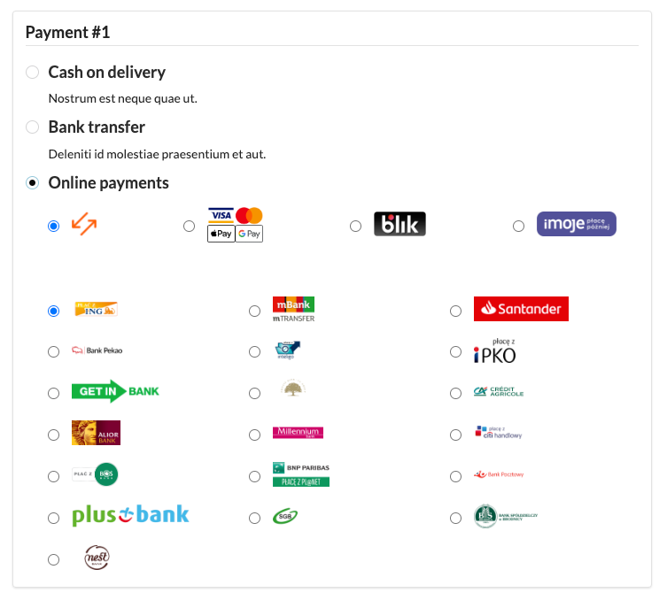
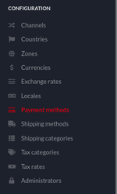
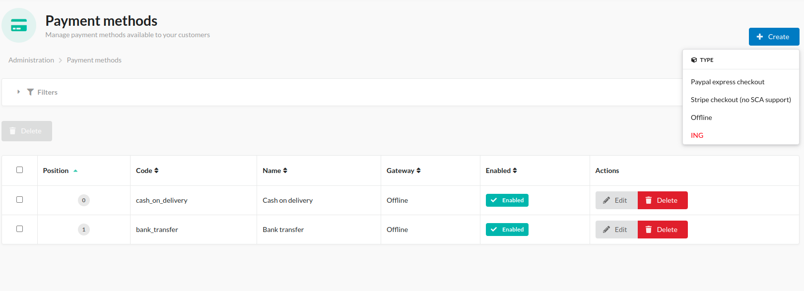
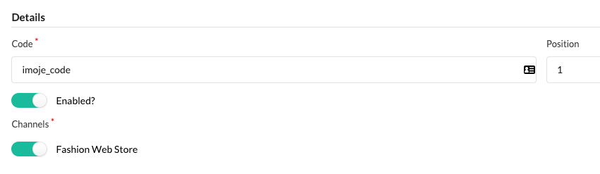
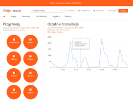
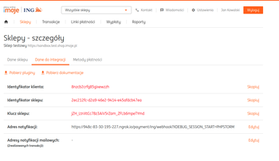
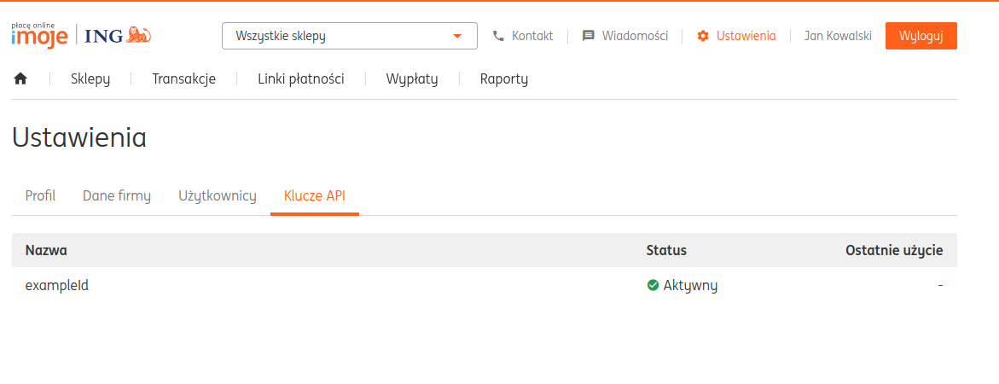
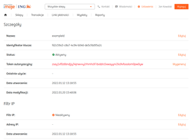
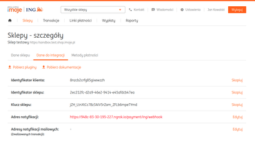
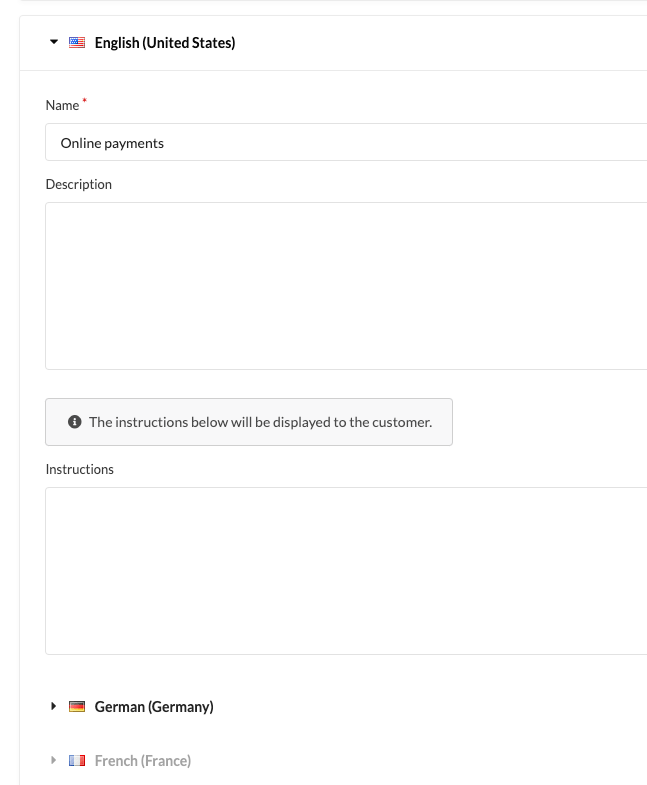

# Imoje Payments Plugin for Sylius
----

We want to impact many unique eCommerce projects and build our brand recognition worldwide, so we are heavily involved in creating open-source solutions, especially for Sylius. We have already created over 35 extensions, which have been downloaded almost 2 million times.

You can find more information about our eCommerce services and technologies on our website: https://bitbag.io/. We have also created a unique service dedicated to creating plugins: https://bitbag.io/services/sylius-plugin-development. 

Do you like our work? Would you like to join us? Check out the “Career” tab: https://bitbag.io/pl/kariera. 

# About us
----
BitBag is a software house that implements tailor-made eCommerce platforms with the entire infrastructure—from creating eCommerce platforms to implementing PIM and CMS systems to developing custom eCommerce applications, specialist B2B solutions, and migrations from other platforms.

We actively participate in Sylius's development. We have already completed over 150 projects, cooperating with clients from all over the world, including smaller enterprises and large international companies. We have completed projects for such important brands as **Mytheresa, Foodspring, Planeta Huerto (Carrefour Group), Albeco, Mollie, and ArtNight.**

[More case studies >> ](https://bitbag.io/case-studies)

We have a 70-person team of experts: business analysts and eCommerce consultants, developers, project managers, and QA testers.

**Our services:**
* B2B and B2C eCommerce platform implementations
* Multi-vendor marketplace platform implementations
* eCommerce migrations
* Sylius plugin development
* Sylius consulting
* Project maintenance and long-term support
* PIM and CMS implementations

**Some numbers from BitBag regarding Sylius:**
* 70 experts on board 
* +150 projects delivered on top of Sylius,
* 30 countries of BitBag’s customers,
* 7 years in the Sylius ecosystem.
* +35 plugins created for Sylius
  
----
 [](https://bitbag.io/contact-us/?utm_source=github&utm_medium=referral&utm_campaign=plugins_imoje)

----

## Table of Content

***

* [Overview](#overview)
* [Installation](#installation)
  * [Requirements](#requirements)
  * [Configuration](#configuration)
  * [Usage](#usage)
* [Additional resources for developers](#additional-resources-for-developers)
* [License](#license)
* [Contact and Support ](#contact-and-support)
* [Community](#community)

# Overview
----
Strengthen your eCommerce with our imoje integration with Sylius. Imoje is a Polish payment gateway supported by ING Bank Śląski. The provider offers all the most popular payment methods such as BLIK, e-transfers, card payments, ApplePay and Google Pay, deferred payments "imoje pay later," as well as Partial and full refunds and payments in foreign currencies.




The integration currently supports the following payment methods:

1. Cards
2. Blik
3. Pay by link
4. imoje pay later


# Installation
----
The installation process for the Imoje Payments Plugin can be found [here](https://github.com/BitBagCommerce/SyliusImojePlugin/blob/master/doc/installation.md).

## Requirements
----
We work on stable, supported, and up-to-date versions of packages. We recommend you do the same.

| Package              | Version        |
|----------------------|----------------|
| PHP                  | ^8.0           |
| sylius/refund-plugin | ^1.0.0         |
| sylius/sylius        | ~1.12 or ~1.13 |


## Configuration:
----

You need to put the path to wkhtmltopdf in your .env file.
```
WKHTMLTOPDF_PATH=/usr/local/bin/wkhtmltopdf
```

To create an Imoje-based payment method, go to Payment methods in the Sylius admin panel.


  

After that, you need to add an Imoje payment:


  

And now, you can configure your payment method in the admin panel:
* first you need to add a gateway code, for example "imoje_code" and set its position.


  
* To configure the imoje gateway, log in to Imoje admin panel.


  
* From "Settings" -> "Data for integration" you can acquire all the needed keys:

* merchantId,
* serviceId,
* shopKey

  
* You also need an authorization token, so you need to go to:
  "Settings" -> "API Keys". And click on your "API key". This will be your authorization token.

  

  
* Also, you need to configure the path to your webhooks, just type in your shop URL followed by /payment/imoje/webhook.

  
* Now you need to add a URL in the admin panel for the production API URL:

  ```
  https://api.imoje.pl/v1/merchant
  ```
* And the sandbox API URL:
  ```
  https://sandbox.api.imoje.pl/v1/merchant
  ```

* To end up you can choose which payment-by-link you want to use.

  

* And now you have to set a proper name for your payment method (keep in mind that Imoje supports multiple online payment methods), and click "Create".

  


## Usage
----
This plugin allows you to use the payment solution delivered by Imoje.

If you need some help with Sylius development, don't be hesitated to contact us directly. You can fill the form on [this site](https://bitbag.io/contact-us/?utm_source=github&utm_medium=referral&utm_campaign=plugins_mollie) or send us an e-mail to hello@bitbag.io!

# Demo 
---
We created a demo app with some useful use-cases of plugins! Visit http://demo.sylius.com/ to take a look at it.


**If you need an overview of Sylius' capabilities, schedule a consultation with our expert.**

[](https://bitbag.io/contact-us/?utm_source=github&utm_medium=referral&utm_campaign=plugins_mollie)

# Additional resources for developers
---
To learn more about our contribution workflow and more, we encourage you to use the following resources:
* [Sylius Documentation](https://docs.sylius.com/en/latest/)
* [Sylius Contribution Guide](https://docs.sylius.com/en/latest/contributing/)
* [Sylius Online Course](https://sylius.com/online-course/)
* [Case study Imoje](https://bitbag.io/case-studies/imoje)

# License
---

This plugin's source code is completely free and released under the terms of the MIT license.

[//]: # (These are reference links used in the body of this note and get stripped out when the markdown processor does its job. There is no need to format nicely because it shouldn't be seen.)

# Contact and Support
---
This open-source plugin was developed to help the Sylius community. If you have any additional questions, would like help with installing or configuring the plugin, or need any assistance with your Sylius project - let us know! **Contact us** or send us an **e-mail to hello@bitbag.io** with your question(s).

[](https://bitbag.io/contact-us/?utm_source=github&utm_medium=referral&utm_campaign=plugins_ing)


# Community
---
For online communication, we invite you to chat with us & other users on [Sylius Slack](https://sylius-devs.slack.com/).

[](https://bitbag.io/contact-us/?utm_source=github&utm_medium=referral&utm_campaign=plugins_mollie)
