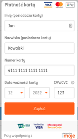

<p align="center">
    <a href="https://sylius.com" target="_blank">
        
    </a>
</p>

<h1 align="center">SyliusIngPlugin</h1>

<p align="center">Payment gateway for ING</p>

## Documentation

For a comprehensive guide on Sylius Plugins development please go to Sylius documentation,
there you will find the <a href="https://docs.sylius.com/en/latest/plugin-development-guide/index.html">Plugin Development Guide</a>, that is full of examples.

## Quickstart Installation

1. Run `composer create-project sylius/plugin-skeleton ProjectName`.

2. From the plugin skeleton root directory, run the following commands:

    ```bash
    $ (cd tests/Application && yarn install)
    $ (cd tests/Application && yarn build)
    $ (cd tests/Application && APP_ENV=test bin/console assets:install public)
    
    $ (cd tests/Application && APP_ENV=test bin/console doctrine:database:create)
    $ (cd tests/Application && APP_ENV=test bin/console doctrine:schema:create)
    ```

To be able to setup a plugin's database, remember to configure you database credentials in `tests/Application/.env` and `tests/Application/.env.test`.

## ING Payments Plugin for Sylius
At BitBag we do believe in open source. However, we are able to do it just because of our awesome clients, who are kind enough to share some parts of our work with the community. Therefore, if you feel like there is a possibility for us working together, feel free to reach us out. You will find out more about our professional services, technologies and contact details at [https://bitbag.io/](https://bitbag.io/?utm_source=github&utm_medium=referral&utm_campaign=plugins_mollie).


## Overview




The integration currently supports the following payment methods:

1. Cards
2. Blik
3. ING
4. Pay by link

## We are here to help
This **open-source plugin was developed to help the Sylius community** If you have any additional questions, would like help with installing or configuring the plugin or need any assistance with your Sylius project - let us know!

[](https://bitbag.io/contact-us/?utm_source=github&utm_medium=referral&utm_campaign=plugins_mollie)


# Installation
----

### Requirements

We work on stable, supported and up-to-date versions of packages. We recommend you to do the same.

| Package | Version |
| --- | --- |
| PHP |  ^7.2 |
| ext-json: * |  |
| sylius/refund-plugin |  ^1.0.0-RC.3 |
| sylius/sylius |  ^1.9.0 |

## Usage

This plugin allows you to use the payment gateway delivered from ing

### Instalation
```
$ composer install
$ cd tests/Application
$ yarn install
$ yarn encore dev
$ bin/console assets:install -e test
$ bin/console doctrine:database:create -e test
$ bin/console doctrine:schema:create -e test
$ symfony server:start
$ open http://localhost:8080 // or the port showed in your terminal while runing command with symfony server:start
```

### Configuration:
In your .env file, you need put there environment variables with data where is your wkhtmltopdf
```
WKHTMLTOPDF_PATH=/usr/local/bin/wkhtmltopdf
```

### Configuration in Admin tanel:
First you need to add ing payment method. So you need to go in admin panel to "Configuration" and after to "Payment methods".


After that, you need to add ING payment :


And now, we can configure our payment method in admin panel
* first we need write some gateway code for example "ing_code" and add position, for egzample 1
  
* To configuration gateway we need to go to our imoje account and login there. After that we have a administration panel
  
* Now we need to go for MerchantId, ServiceID and ShopKey. So we need go to "Settings" and after go to "data for integration", and there is our data
  
* We also need authorization token, so we need to go to:
  Settings->Api Keys. And to our action. There is our authorization token
  
  
* Also, we need write path for our webhooks. So write your shop url and paste "/payment/ing/webhook". Like in screen bellow
  
* Now we need paste url in our admin panel for production and sandbox gateway

```
https://sandbox.api.imoje.pl/v1/merchant
```
or
```
https://api.imoje.pl/v1/merchant
```

* And now, we can choose witch payment by link we want. After that we need add name for out gateway and click "create"


# About us
---

BitBag is a company of people who **love what they do** and do it right. We fulfill the eCommerce technology stack with **Sylius**, Shopware, Akeneo and Pimcore for PIM, eZ Platform for CMS and VueStorefront for PWA. Our goal is to provide real digital transformation with an agile solution that scales with the **clients’ needs**. Our main area of expertise includes eCommerce consulting and development for B2C, B2B, and Multi-vendor Marketplaces.  
We are advisers in the first place. We start each project with a diagnosis of problems, and an analysis of the needs and **goals** that the client wants to achieve.  
We build **unforgettable**, consistent digital customer journeys on top of the **best technologies**.Based on a detailed analysis of the goals and needs of a given organization we create dedicated systems and applications that let businesses grow.  
Our team is fluent in **Polish, English, German and French**. That is why our cooperation with clients from all over the world is smooth.

**Some numbers from BitBag regarding Sylius:**
- 50+ **experts** including consultants, UI/UX designers, Sylius trained front-end and back-end developers,
- 120+ projects **delivered** on top of Sylius,
- 25+ **countries** of BitBag’s customers,
- 4+ **years** in the Sylius ecosystem.

**Our services:**
- Business audit/Consulting in the field of **strategy** development,
- Data/shop **migration**,
- Headless **eCommerce**,
- Personalized **software** development,
- **Project** maintenance and long term support,
- Technical **support**.

**Key clients:** Mollie, Guave, P24, Folkstar, i-LUNCH, Elvi Project, WestCoast Gifts.

---

If you need some help with Sylius development, don't be hesitated to contact us directly. You can fill the form on [this site](https://bitbag.io/contact-us/?utm_source=github&utm_medium=referral&utm_campaign=plugins_mollie) or send us an e-mail to hello@bitbag.io!

---

[](https://bitbag.io/contact-us/?utm_source=github&utm_medium=referral&utm_campaign=plugins_mollie)

## Community
For online communication, we invite you to chat with us & other users on [Sylius Slack](https://sylius-devs.slack.com/).

# Demo Sylius Shop

---

We created a demo app with some useful use-cases of plugins!
Visit [sylius-demo.bitbag.io](https://sylius-demo.bitbag.io/) to take a look at it. The admin can be accessed under
[sylius-demo.bitbag.io/admin/login](https://sylius-demo.bitbag.io/admin/login) link and `sylius: sylius` credentials.
Plugins that we have used in the demo:

| BitBag's Plugin | GitHub | Sylius' Store|
| ------ | ------ | ------|
| ACL Plugin | *Private. Available after the purchasing.*| https://plugins.sylius.com/plugin/access-control-layer-plugin/|
| Braintree Plugin | https://github.com/BitBagCommerce/SyliusBraintreePlugin |https://plugins.sylius.com/plugin/braintree-plugin/|
| CMS Plugin | https://github.com/BitBagCommerce/SyliusCmsPlugin | https://plugins.sylius.com/plugin/cmsplugin/|
| Elasticsearch Plugin | https://github.com/BitBagCommerce/SyliusElasticsearchPlugin | https://plugins.sylius.com/plugin/2004/|
| Mailchimp Plugin | https://github.com/BitBagCommerce/SyliusMailChimpPlugin | https://plugins.sylius.com/plugin/mailchimp/ |
| Multisafepay Plugin | https://github.com/BitBagCommerce/SyliusMultiSafepayPlugin |
| Wishlist Plugin | https://github.com/BitBagCommerce/SyliusWishlistPlugin | https://plugins.sylius.com/plugin/wishlist-plugin/|
| **Sylius' Plugin** | **GitHub** | **Sylius' Store** |
| Admin Order Creation Plugin | https://github.com/Sylius/AdminOrderCreationPlugin | https://plugins.sylius.com/plugin/admin-order-creation-plugin/ |
| Invoicing Plugin | https://github.com/Sylius/InvoicingPlugin | https://plugins.sylius.com/plugin/invoicing-plugin/ |
| Refund Plugin | https://github.com/Sylius/RefundPlugin | https://plugins.sylius.com/plugin/refund-plugin/ |

**If you need an overview of Sylius' capabilities, schedule a consultation with our expert.**

[](https://bitbag.io/contact-us/?utm_source=github&utm_medium=referral&utm_campaign=plugins_mollie)

## Additional resources for developers
---
To learn more about our contribution workflow and more, we encourage you to use the following resources:
* [Sylius Documentation](https://docs.sylius.com/en/latest/)
* [Sylius Contribution Guide](https://docs.sylius.com/en/latest/contributing/)
* [Sylius Online Course](https://sylius.com/online-course/)

## License
---

This plugin's source code is completely free and released under the terms of the MIT license.

[//]: # (These are reference links used in the body of this note and get stripped out when the markdown processor does its job. There is no need to format nicely because it shouldn't be seen.)

## Contact
---
If you want to contact us, the best way is to fill the form on [our website](https://bitbag.io/contact-us/?utm_source=github&utm_medium=referral&utm_campaign=plugins_mollie) or send us an e-mail to hello@bitbag.io with your question(s). We guarantee that we answer as soon as we can!

[](https://bitbag.io/contact-us/?utm_source=github&utm_medium=referral&utm_campaign=plugins_mollie)
